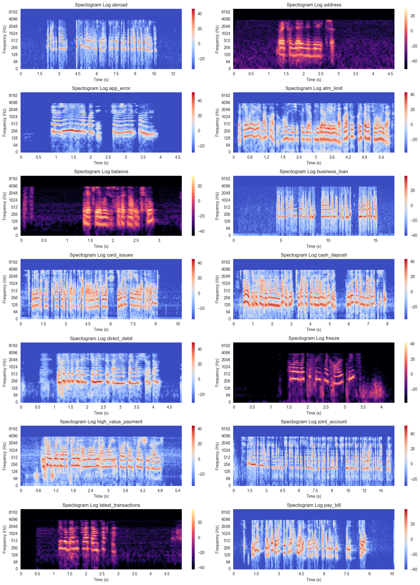
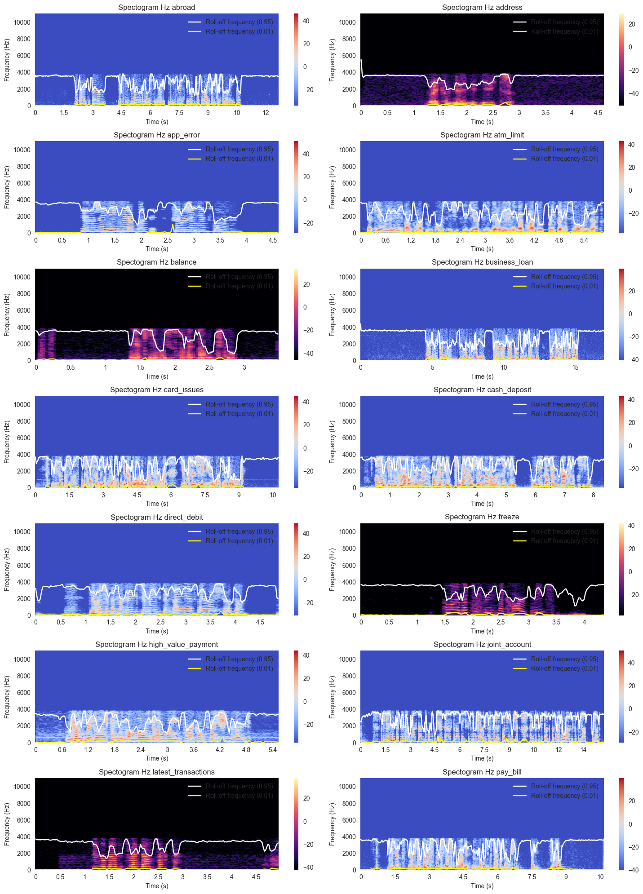

# :large_blue_circle: **Objective** :large_blue_circle:
This audio classification project was created with the automodel of `facebook/wav2vec2-base`. This project uses the entire dataset from [PolyAI/MINDS14](https://huggingface.co/datasets/PolyAI/minds14) with a column that acts as a label, namely `intent_class`
  

# :large_blue_circle: **Dataset and Tools Used** :large_blue_circle:
### :triangular_flag_on_post: **Dataset**
This dataset uses the `PolyAI/MINDS14` dataset from [Huggingface](https://huggingface.co/datasets/PolyAI/minds14)
  

### :triangular_flag_on_post: **Code Editor**
The code editor I used in this project was Google Colab to create the model, while I used Visual Studio Code locally to perform Exploratory Data Analysis. I also use a virtual environment to process EDA.
  

# :large_blue_circle: **Report** :large_blue_circle:
### :triangular_flag_on_post: **[Load Data](https://github.com/firdh0/AI-Project/blob/main/Deep%20Learning/Text%20Summarization/0_Load%20Data.ipynb)**
At the data load stage, I took the path of each data (I made it a dataframe) to simplify the Explorative Data Analysis (EDA) process. Previously, I had divided the data into two parts, namely training data and testing data. Next, I grouped each path according to the categories contained in `intent_class`.
  

### :triangular_flag_on_post: **[EDA](https://github.com/firdh0/AI-Project/blob/main/Deep%20Learning/Text%20Summarization/1_Preprocessing%20Data.ipynb)**
At this EDA stage, I display several graphs that I think are quite necessary to know the data characteristics of each `intent_class`. I retrieve the data for each `intent_class` by taking the first order of all the data in the dataframe as a result of [Load Data](). The following are the EDA results that I have obtained:

#### :beginner: **Distribution All Data, Train Data, and Test Data**

#### :beginner: **Displays a Waveform Diagram for each intent_class**

#### :beginner: **Displays a Spectogram Diagram for each intent_class**
* Hertz  
    
* Log  
    `log`: The spectrum is displayed on a logarithmic scale, where differences between small values are magnified, allowing more detail to be seen in the lower frequency regions.
    

#### :beginner: **Displays Spectral Centroid for each intent_class**
The spectral centroid provides an idea of how far the frequency center of mass is located in the sound spectrum. The higher the spectral centroid, the more concentrated the frequencies are in the high part of the spectrum, which can be interpreted as a brighter or higher sound. Conversely, a lower spectral centroid may indicate a fainter or lower sound.
* Hertz  
    
* Log  
    

#### :beginner: **Displays Spectral Roll-off for each intent_class**
Intuitively, the spectral roll-off point indicates the frequency boundary where most of the frequency energy in the signal resides.
* Hertz  
    
* Log  
    

#### :beginner: **Displays MFCC for each intent_class**
MFCCs can be thought of as “boxes” or “bins” in the histogram. Each MFCC represents the contribution of frequencies in a certain range to a time frame. In other words, MFCCs describe how much energy or frequency information is present in that time frame.

#### :beginner: **Displays Chroma for each intent_class**
Chroma describes the distribution of frequency energy within a class of tones or musical notes. It provides information about the tonality and harmony of sounds.

Chroma is usually calculated as a feature vector with 12 elements, representing 12 note classes (7 major notes + 5 sharp notes).
* Chroma STFT  
    STFT Chroma helps describe how much energy each class of notes contains in a musical context. This is useful for assessing how similar two pieces of music are or for supporting automatic speech recognition systems.  
    
* Chroma CQT  
    
* Chroma CENS  
    

 

### :triangular_flag_on_post: **[Model](https://github.com/firdh0/AI-Project/blob/main/Deep%20Learning/Text%20Summarization/1_Preprocessing%20Data.ipynb)**
At this model stage I did several experiments with only 2 things that I changed, namely `num_train_epochs` from 2, 4, 8, 16 and `learning_rate` from 2e-5 and 4e-5

#### :beginner: **Attempt 1**
The first experiment was performed with `num_train_epochs` of 2, 4, 8, 16 and with `learning_rate` 2e-5
     

#### :beginner: **Attempt 2**
The second experiment was carried out with `num_train_epochs` of 2, 4, 8, 16 and with `learning_rate` 4e-5
     

#### :beginner: **Conclusion**
From experiments 1 and 2 the following conclusions can be drawn:
* Even though `num_train_epochs` and `learning_rate` were raised it was still not possible for the model to get an accuracy above 0.1 and only ranged from 0.07 - 0.09

* In the second experiment it can be seen that if the `learning_rate` is increased to 4e-5 then epoch 0 will get an accuracy of 0.09 but over time as the epoch increases the accuracy decreases and becomes unstable but is still around 0.07 - 0.09

* From the experimental results above, it can be understood that:
     * Dataset [PolyAI/MINDS14](https://huggingface.co/datasets/PolyAI/minds14) is not suitable for using `Wav2Vec` models
     * At the [EDA]() stage, it can be seen that the distribution of the data is unbalanced and at the model creation stage there is no oversampling process with data augmentation or undersampling so it could affect the model which in the end only gets such accuracy.