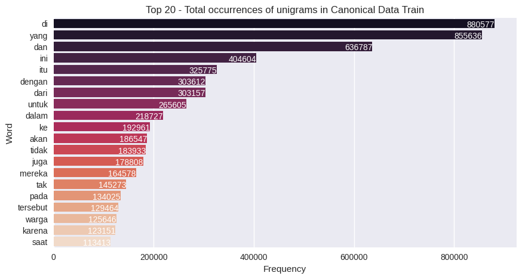
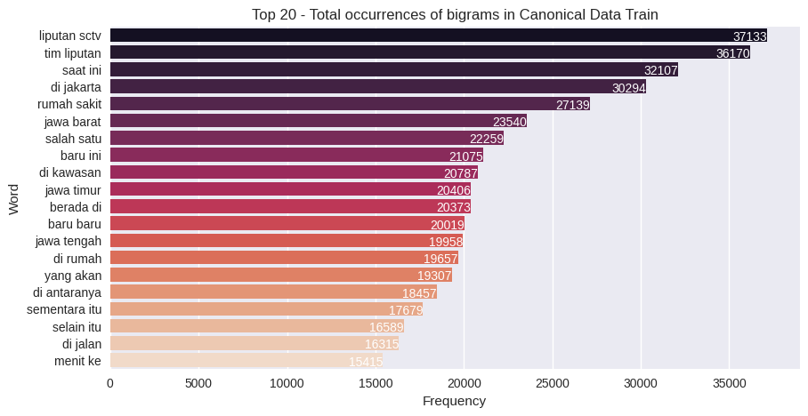
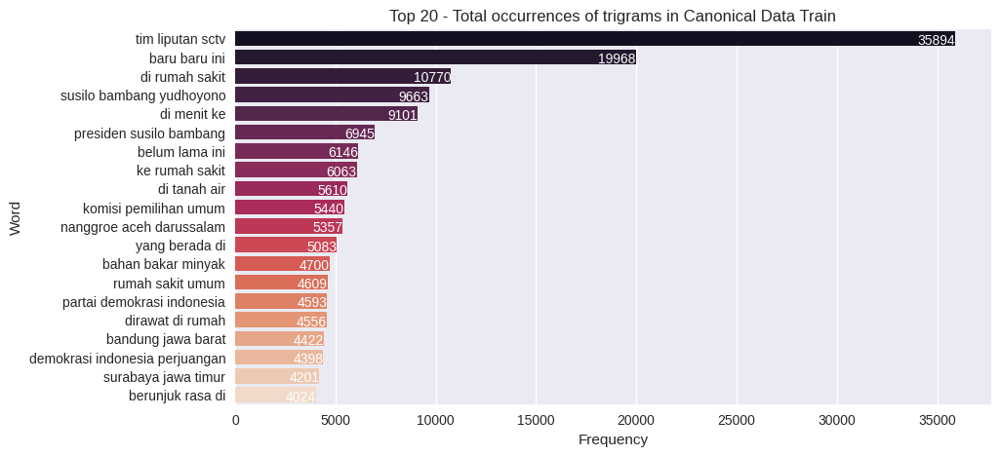
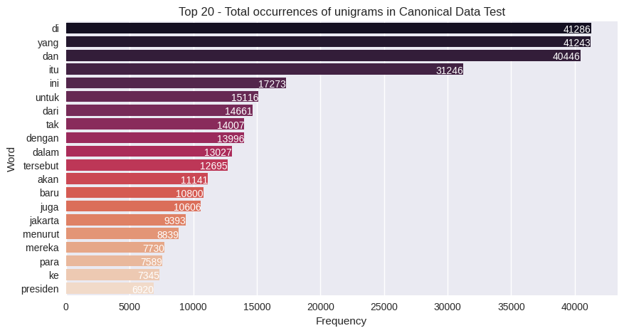
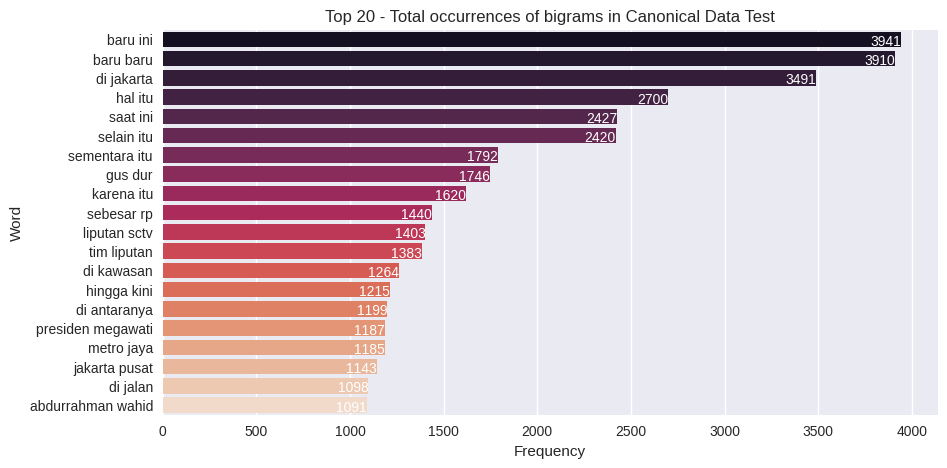
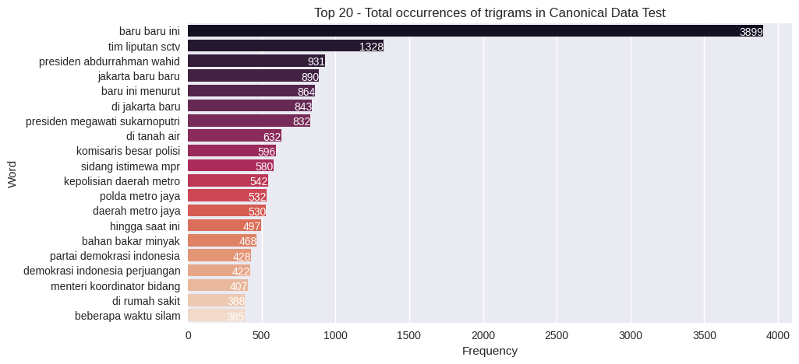
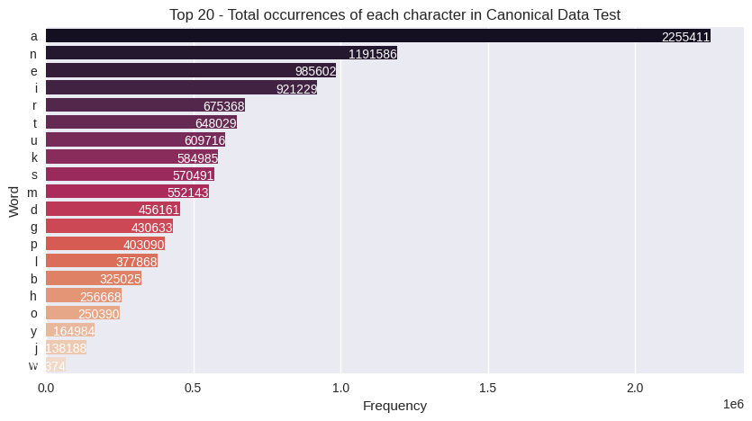
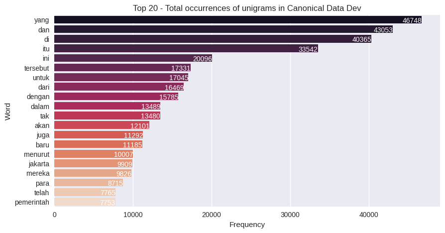
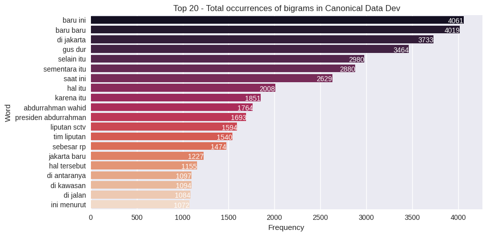

# :large_blue_circle: **Objective** :large_blue_circle:
This summary project was created with an encoder and decoder of a pretrained `bert-base-uncased` bert model using 20% of the data from the dataset due to limited computing resources
  

# :large_blue_circle: **Materials and Tools Used** :large_blue_circle:
### :triangular_flag_on_post: **Dataset**
This dataset uses the `id_liputan6` dataset from [Huggingface](https://huggingface.co/datasets/id_liputan6)
  

# :large_blue_circle: **Report** :large_blue_circle:
### :triangular_flag_on_post: **[Load Data](https://github.com/firdh0/AI-Project/blob/main/Deep%20Learning/Text%20Summarization/0_Load%20Data.ipynb)**
The original data is stored in JSON form. This time, I took all the data of all types and changed the format to CSV to make it easier to process. The following is a comparison of the amount of existing data:

| Data          | Train    | Dev      | Test      |
| ------------- | :-------:| --------:|  --------:|
| Canonical     | 193,883  | 10,972   | 10,972    |
| Xtreme        | 193,883  |  4,948   |  3,862    |

 
ATTENTION: Due to limited resources, I only use 30% canonical type data
  

### :triangular_flag_on_post: **[Preprocessing](https://github.com/firdh0/AI-Project/blob/main/Deep%20Learning/Text%20Summarization/1_Preprocessing%20Data.ipynb)**
In this step I just deleted all sentences with the pattern `Liputan6. com, [place name]` on all data in canonical and xtreme
  

### :triangular_flag_on_post: **EDA**
In this EDA step, I calculate unigrams, bigrams, trigrams, and letters for each type of canonical data. Then I also counted the number of sentences, number of words, number of letters in each data in each type of canonical data. After that I display the number of shortest and longest sentences from all the data in 1 type of canonical data, as well as the number of words and number of letters

#### :beginner: **Canonical Data Train**
* Unigram  

* Bigram  

* Trigram  
    

* Total characters  
    

* Shortest and Longest of sentence, word, and letter  
    

#### :beginner: **Canonical Data Test**
* Unigram  

* Bigram  

* Trigram  
    

* Total characters  
    

* Shortest and Longest of sentence, word, and letter  
    

#### :beginner: **Canonical Data Dev**
* Unigram  

* Bigram  

* Trigram  
    

* Total characters  
    

* Shortest and Longest of sentence, word, and letter  
    

  

### :triangular_flag_on_post: **Model**
I have just finished the training stage, but unfortunately the process is not complete. I have tried my best to reach the evaluation stage, but due to limited computing power, I decided to use Google Colab. Even though I have been trying for 2 days, unfortunately every time I try, the process always stops because it reaches the Google Colab limit.

From this incident I learned that with limited computing resources the solution could be to reduce the batch size used and add gradient_accumulation_step. When experimenting with batch sizes I found that the value in 2908 would depend on the batch size used `[1139/2908 1:46:44 < 2:46:05, 0.18 it/s, Epoch 0.78/2]`

I also tried weight_decay=0.02 and num_train_epochs=4, the results at step 2 of the validation loss were higher compared to the validation train.

  